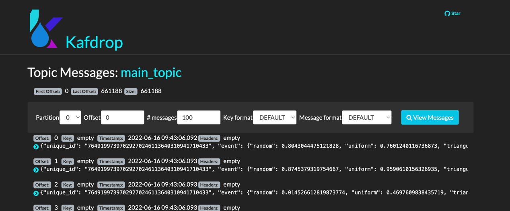

# Kafdrop

The docker compose network uses [kafdrop](https://github.com/obsidiandynamics/kafdrop#:~:text=Kafdrop%20is%20a%20web%20UI,x%2C%20Helm%20and%20Kubernetes.),
which is a particularly helpful web UI for monitoring your Kafka cluster.

Whilst the docker network is up, navigate to http://localhost:9000/ to see the UI for your cluster.


You can navigate to topics to see messages that are currently on each topic & partition:



# Interacting with the cluster via the Kafka shell

The following is a helpful resource: [Master the Kafka shell](https://betterdatascience.com/master-the-kafka-shell-in-5-minutes-topics-producers-and-consumers-explained/).

With your network up, you can exec into the `kafka` container:

```bash
docker exec -it kafka bash
```

From the docker container running a cluster, navigate to the Kafka bin folder, as that’s the folder in which all Kafka shell scripts are located.

```bash
cd /opt/kafka/bin
```

You'll see the following shell scripts with an `ls`:


## Helpful commands

**List topics, partitions and offsets for a consumer:**

```bash
kafka-consumer-groups.sh --describe --group some_group --bootstrap-server kafka:29092
```

**Produce to a topic:**

```bash
kafka-console-producer.sh --broker-list kafka:29092 --topic main_topic
```
